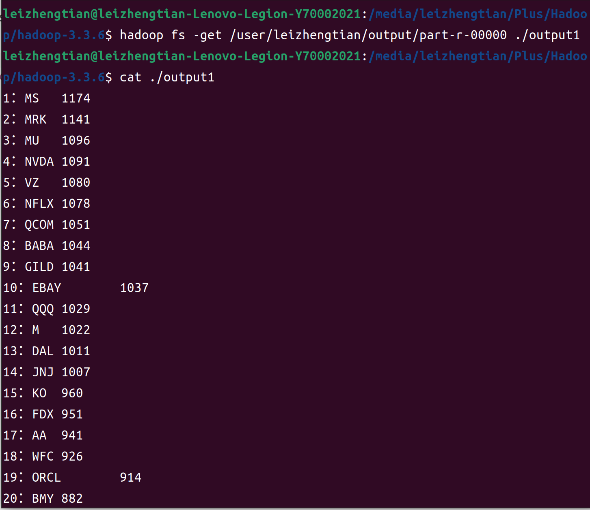
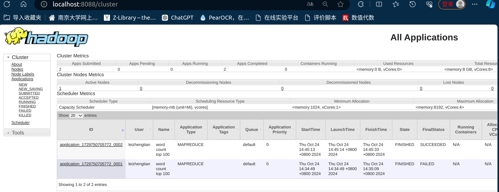

# 题目一
## 设计思路

Hadoop MapReduce 任务分解：

**Mapper** ：负责处理输入的每一行数据。

        输入: 读取 CSV 格式的股票数据。

        处理流程:
            跳过 CSV 的头部行。
            使用 CSVReader 解析每一行，提取第四列（stock列）。
            将股票代码作为键，与计数 1 作为值，(股票代码, 1)键值对发送给 Reducer。

**Reducer** ： 负责聚合来自 Mapper 的数据

        处理流程:
            遍历所有值，计算每个股票代码的总出现次数。
            使用 TreeMap 存储股票代码及其出现次数，确保按次数从大到小排列。
            在 cleanup 方法中，输出按出现次数排序的结果。

**Driver**： 设置作业的输入路径、输出路径、Mapper 和 Reducer 类，并执行作业。

## 运行
实现好StockCount.java文件后，由于在代码文件中使用了opencsv包，然而在hadoop运行环境中不存在这个包，经查阅教程，使用 maven assembly plugin，使用命令 mvn clean assembly:single 来清理项目中之前生成的构建文件，将项目的编译结果和所有依赖项打包到一个独立的 JAR 文件中。
然后使用hadoop jar 命令运行打包好的jar文件：demo-1.0-SNAPSHOT-jar-with-dependencies.jar ，
并且将输入和输出路径作为参数传入：chenqiaolei/analyst_ratings.csv和output.

## 运行结果
成功MapReduce的运行截图：

展示输出文件：

作业运⾏成功的WEB⻚⾯截图：

# 题目二
## 设计思路

**Mappper** : 负责从输入数据中提取单词并进行计数，同时过滤掉停用词。

    处理逻辑：
跳过 CSV 的头部行，并使用 OpenCSV 解析每一行，提取标题内容（title列）。
使用正则表达式去除标题中的标点符号，并转换为小写。
使用 StringTokenizer 逐个处理单词。
使用 HashSet 存储停用词列表，实现忽略停用词，并将有效的单词发送到 Reducer。

**Reducer**：  汇总单词的总出现次数，并输出出现频率最高的前100个单词。 

    处理逻辑：遍历所有值，计算每个单词的总出现次数。
使用 TreeMap 存储单词及其出现次数，以便按出现次数降序排列。
在 cleanup 方法中，输出前 100 个高频单词和对应的出现次数。

**Driver**： main 方法设置 MapReduce 作业的配置。
    
    处理逻辑：检查输入参数，确保提供输入路径、输出路径和停用词文件路径。
创建 Hadoop 作业实例并配置 Mapper 和 Reducer 类。
设置输出键值类型，指定输入和输出路径，启动作业。

## 运行
题目二的实现代码为WordCount.java，同样使用命令 mvn clean assembly:single，生成对应的jar文件。把原先的output文件夹删除后，使用命令“ hadoop jar /media/leizhengtian/Plus/chenqiaolei/homework/demo/target/demo-1.0-SNAPSHOT-jar-with-dependencies.jar com.example.WordCount chenqiaolei/analyst_ratings.csv output /media/leizhengtian/Plus/chenqiaolei/homework/hw5/stop-word-list.txt”。 
需要传入的参数依次为：数据集(csv),输出路径output,停词列表（txt）.
然后使用“hadoop fs -get /user/leizhengtian/output/part-r-00000 ./output2”命令，把output内的输出文件移动到output2. 并查看输出内容。

## 运行结果
成功MapReduce的运行截图：

展示输出文件：

作业运⾏成功的WEB⻚⾯截图：

